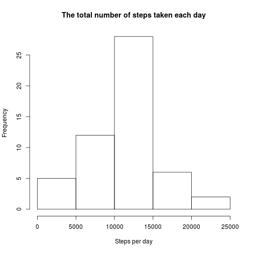
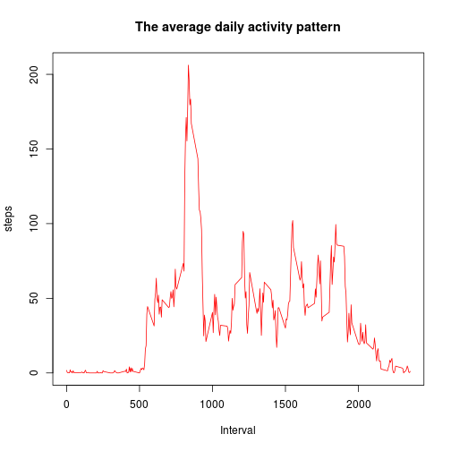
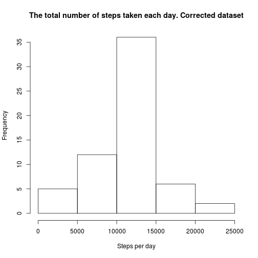
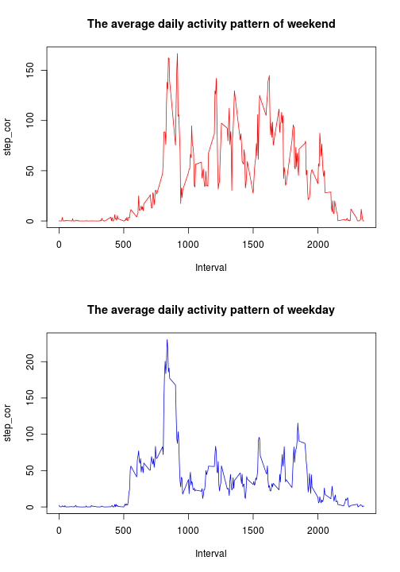

## Loading and preprocessing the data
Load used packages

```r
library(data.table)
library(lubridate)
library(dplyr)
library(tidyr)
library(plyr)
library(Hmisc)
```
Load raw data

```r
fileUrl <- "https://d396qusza40orc.cloudfront.net/repdata%2Fdata%2Factivity.zip"
download.file(fileUrl, destfile = "./activity.zip", method = "curl")
```

Reading loaded data

```r
DT <- read.csv(unz("./activity.zip", "activity.csv"), sep = ",", header = TRUE, 
    	colClasses = c("numeric",
                        "Date",
                        "numeric"),
              strip.white = TRUE,
              na.strings = c("?",""))
DT = data.table(DT)
```

## What is mean total number of steps taken per day?
Calculate the total number of steps taken each day and store it in new data frame

```r
sumDay <- DT %>%
    select(steps, date) %>%
    group_by(date) %>%
    summarise_each(funs(sum))
```

Make a histogram of the total number of steps taken each day

```r
hist(sumDay$steps, main = "The total number of steps taken each day", xlab = "Steps per day")
```

 

Calculate the mean and median of the total number of steps taken per day  
Mean:

```r
mean(sumDay$steps, na.rm = TRUE)
```

```
## [1] 10766.19
```
Median

```r
median(sumDay$steps, na.rm = TRUE)
```

```
## [1] 10765
```

## What is the average daily activity pattern?
Calculate the average number of steps taken of the 5-minute intervals

```r
DT2 <- na.omit(DT)
sum5time <- DT2 %>%
    select(steps, interval) %>%
    group_by(interval) %>%
    summarise_each(funs(mean))
```

Make a time series plot

```r
with(sum5time, plot(interval, steps, type = "l", col = "red", main = "The average daily activity pattern", xlab = "Interval", pch = 20))
```

 

Which 5-minute interval, on average across all the days in the dataset, contains the maximum number of steps?

```r
intMax <- max(sum5time$steps)
max_step <- subset(sum5time, steps == intMax)
print(max_step)
```

```
## Source: local data table [1 x 2]
## 
##   interval    steps
## 1      835 206.1698
```

## Imputing missing values
Calculate and report the total number of missing values in the dataset (i.e. the total number of rows with NAs)

```r
table(is.na(DT$steps))[[2]]
```

```
## [1] 2304
```

Filling in all of the missing values in the dataset mean of the same interval.

```r
DT3 <- ddply(DT, "interval", mutate, step_cor = impute(steps, mean))
```

Make a histogram of the total number of steps taken each day and Calculate and report the mean and median total number of steps taken per day.

```r
DT3$step_cor <- as.numeric(DT3$step_cor)
sumDay_cor <- DT3 %>%
    select(step_cor, date) %>%
    group_by(date) %>%
    summarise_each(funs(sum))

hist(sumDay_cor$step_cor, main = "The total number of steps taken each day. Corrected dataset", xlab = "Steps per day")
```

 

Compare Mean and Median from original and corrected dataset:

```r
mean <- c(mean(sumDay$steps, na.rm = TRUE), mean(sumDay_cor$step_cor))
median <- c(median(sumDay$steps, na.rm = TRUE), median(sumDay_cor$step_cor))
tbl <- cbind(mean, median)
rownames(tbl) <- c("original", "corrected")
print(tbl, type = "html")
```

```
##               mean   median
## original  10766.19 10765.00
## corrected 10766.19 10766.19
```


## Are there differences in activity patterns between weekdays and weekends?

Create a new factor variable in the dataset with two levels – “weekday” and “weekend”

```r
## save current system's locale
locale <- Sys.getlocale(category = "LC_TIME")

## set English locale in order to have labels printed in English
Sys.setlocale("LC_TIME", "en_US.UTF-8")
```

```
## [1] "en_US.UTF-8"
```

```r
weekDay <- mutate(DT3, weekday = weekdays(date))

weekend <- weekDay %>%
    filter(weekday == "Sunday" | weekday == "Saturday") %>%
    select(interval, step_cor) %>%
    group_by(interval) %>%
    summarise_each(funs(mean))

weekday <- weekDay %>%
    filter(weekday == "Friday" | weekday == "Monday" | weekday == "Thursday" | weekday == "Tuesday" | weekday == "Wednesday") %>%
    select(interval, step_cor) %>%
    group_by(interval) %>%
    summarise_each(funs(mean))

## restore system's original locale
Sys.setlocale("LC_TIME", locale)
```

```
## [1] "ru_RU.UTF-8"
```

Make a time series plot of “weekday” and “weekend”

```r
par(mfrow = c(2, 1))
with(weekend, plot(interval, step_cor, type = "l", col = "red", main = "The average daily activity pattern of weekend", xlab = "Interval", pch = 20))
with(weekday, plot(interval, step_cor, type = "l", col = "blue", main = "The average daily activity pattern of weekday", xlab = "Interval", pch = 20))
```

 
